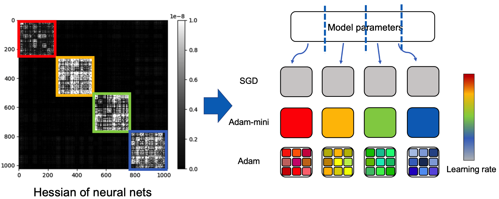
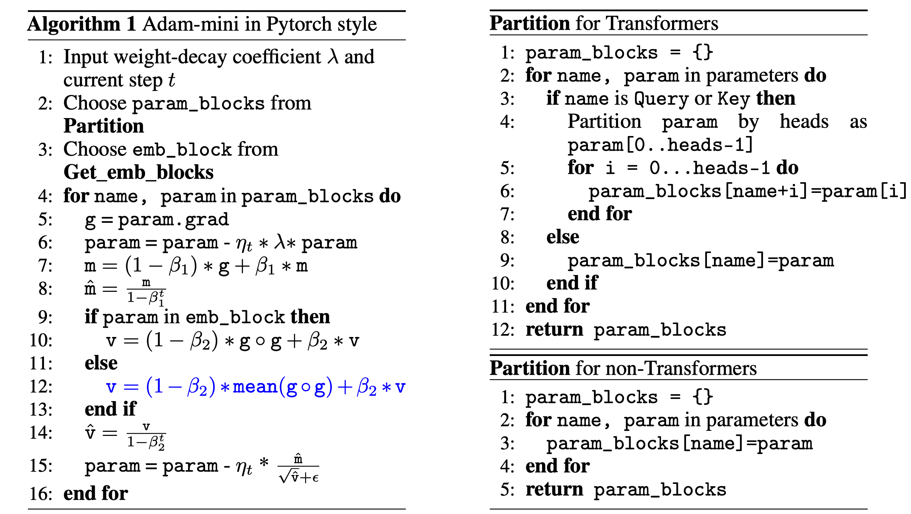

# Adam-mini
This repository contains PyTorch implementation of Adam-mini,  an optimizer that achieves on-par or better performance than AdamW with **45% to 50%** less memory footprint.  

Adam-mini reduces memory by cutting down the learning rate (lr) resources in Adam (i.e.,  $1/\sqrt{v}$): we argue that >90% of these lr in $v$ could be harmlessly removed if we:

(1) carefully partition the parameters into blocks following our proposed principle related to **Hessian structure**.  
(2) assign a single **but good** lr to each parameter block.  

We find a cheap and effective way to reach these requirements. The resulting algorithm is shown below in **Algorithm 1**. Check out more detailed descriptions in our paper: [Adam-mini: Use Fewer Learning Rates To Gain More](https://arxiv.org/abs/2402.16788).







## How to use 

You can use Adam-mini optimizer as follows. Our implementation supports popular distributed frameworks including DDP, FSDP, and [DeepSpeed](https://github.com/microsoft/DeepSpeedExamples/tree/master/applications/DeepSpeed-Chat).

```
import Adam_mini

optimizer = Adam_mini.Adam_mini(
model = model, 
lr = learning_rate, 
weight_decay = weight_decay, 
beta1 = beta1, 
beta2 = beta2, 
epsilon = epsilon,
model_sharding = True, 
n_embd = n_embd, 
n_head = n_head, 
n_query_groups = n_query_groups)
```


**Regarding all the hyperparameters** including learning rate (lr), weight_decay, beta1, beta2, epsilon, we recommend using the same values as those used for AdamW.


If you are training a language model, please pass the following info to Adam-mini:

- model_sharding: set to True if you are using model parallelism with more than 1 GPU, including FSDP and zero_1,2,3 in Deepspeed. Set to False if you are using DDP or single-GPU training.

- n_embd: number of embedding dimensions. Could be unspecified if you are training non-transformer models.
- n_head: number of attention heads. Could be unspecified if you are training non-transformer models.
- n_query_groups: number of query groups in Group query Attention. If not specified, it will be equal to n_head. Could be unspecified if you are training non-transformer models.


We here provide sample code on pre-training, SFT, and RLHF. You need  2xA800-80GB or 2xA100-80GB GPUs to run the experiments below.

### Example 1: Pre-training 

We pre-train GPT2 series (125M-1.5B) using [NanoGPT](https://github.com/karpathy/nanoGPT) codebase under DDP framework.  Install dependencies from pip:

```
conda env create -f gpt2/environment.yml
conda activate gpt2
cd gpt2
```

Run the code for GPT2 pre-training:

```
bash run_gpt2.sh 
```

We also pre-train Llama series (1B and 7B) using  [TinyLlama](https://github.com/jzhang38/TinyLlama) codebase under FSDP framework. We are now wrapping up the code and it will come soon.

### Example 2: Supervised Fine-tuning and RLHF 

We fine-tune Llama2-7B using  [ReMax](https://github.com/liziniu/ReMax) codebase under [DeepSpeed](https://github.com/microsoft/DeepSpeedExamples/tree/master/applications/DeepSpeed-Chat) framework.  Install dependencies from pip:

```
conda env create -f RLHF/environment.yml
conda activate rlhf
cd RLHF
```

Run the code for SFT with LoRA :

```
bash training_scripts/sft/run_sft_lora.sh 
```

Run the code for full-parameter SFT :

```
bash training_scripts/sft/run_sft_full.sh
```

Run the code for reward model training in RLHF 

```
bash training_scripts/reward/run_reward.sh 
```

Run the code for reward optimization in RLHF using ReMax:

```
bash training_scripts/po/remax/run_remax.sh 
```


## Remarks

**About checkpoint saving:**  If you are using FSDP distributed framework, please set "use_orig_params  = False"  in your FSDPStrategy. This allows you to save and load checkpoint without any issue.   Conversely, using the default setting of "use_orig_params = True" may result in errors during checkpoint saving. We are now addressing this issue and aim to resolve it shortly.


## Acknowledgements

The above code is heavily based on the codebase of [NanoGPT](https://github.com/karpathy/nanoGPT),  [TinyLlama](https://github.com/jzhang38/TinyLlama),  [ReMax](https://github.com/liziniu/ReMax), and [DeepSpeed](https://github.com/microsoft/DeepSpeedExamples/tree/master/applications/DeepSpeed-Chat). 

## Citation

If you find this code helpful, please cite our paper in the following format.

```
@article{zhang2024adam,
  title     = {Adam-mini: Use Fewer Learning Rates To Gain More},
  author    = {Zhang, Yushun and Chen, Congliang  and Li, Ziniu and Ding, Tian and Wu, Chenwei and Ye, Yinyu and Luo, Zhi-Quan and Sun, Ruoyu},
  booktitle = {arXiv preprint arXiv:2406.16793},
  year      = {2024},
}
```
