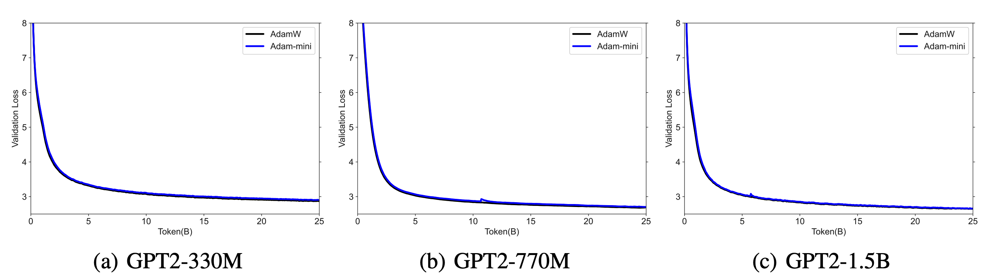
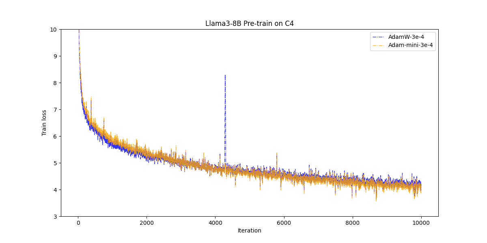
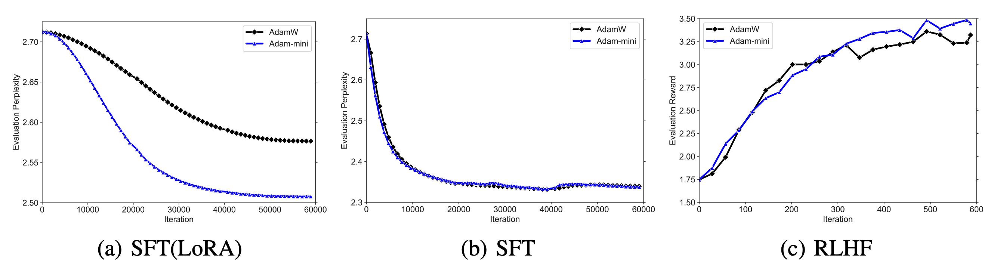

# Adam-mini
This repository contains the official PyTorch implementation of Adam-mini optimizer,  a mini-version of Adam that achieves on-par or better performance than AdamW with **45% to 50%** less memory footprint.  

Adam-mini reduces memory by cutting down the learning rate (lr) resources in Adam (i.e.,  $1/\sqrt{v}$): we argue that >90% of these lr in $v$ could be harmlessly removed if we:

(1) carefully partition the parameters into blocks following our proposed principle related to **Hessian structure**.  
(2) assign a single **but good** lr to each parameter block.  

We find a cheap and effective way to reach these requirements. The resulting algorithm is shown below in **Algorithm 1**. Check out more detailed descriptions in our paper: [Adam-mini: Use Fewer Learning Rates To Gain More](https://arxiv.org/abs/2406.16793).


## How to use 

Install torch (>=1.8.0) and run the following commands.

```
pip install adam-mini
```

or if you prefer to import from source

```
git clone https://github.com/zyushun/Adam-mini
cd Adam-mini
pip install -e .
```

Then use Adam-mini optimizer as follows.

```
from adam_mini import Adam_mini

optimizer = Adam_mini(
            named_parameters = model.named_parameters(), 
            lr = lr, 
            betas = (beta1,beta2), 
            eps = eps,
            weight_decay = weight_decay, 
            dim = model_config.dim,
            n_heads = model_config.n_heads,
            n_kv_heads = model_config.n_kv_heads,
            )
            
```


**Hyperparameter choices:** Regarding learning rate (lr), weight_decay, beta1, beta2, eps, we recommend using the same values as those used for AdamW.

If you are training Transformers, please also pass the following info to Adam-mini:

- dim: dimension for hidden feature. Could be unspecified if you are training non-transformer models.

- n_heads: number of attention heads. Could be unspecified if you are training non-transformer models.

- n_kv_heads: number of head for Key and Value. Or equivalently, number of query groups in Group query Attention. Also known as "n_query_groups".  If is None, it will be the same value as n_head. Could be unspecified if you are training non-transformer models.


## Support

Our current implementation of Adam-mini supports popular distributed frameworks and codebase including:

1. DDP distributed framework
2. FSDP distributed framework
3. [DeepSpeed](https://github.com/microsoft/DeepSpeed)
4. [Hugginface Trainer](https://huggingface.co/docs/transformers/en/main_classes/trainer) 
5. [Torchtitan](https://github.com/pytorch/torchtitan) 
6. [LLaMA-Factory](https://github.com/hiyouga/LLaMA-Factory). Detailed usage instruction can be seen in  [examples](https://github.com/hiyouga/LLaMA-Factory/blob/main/examples/README_zh.md) 
7. More is coming! Do not hesitate to contact us if Adam-mini does not support your codebase!


## Examples

We here provide sample code on pre-training, SFT, and RLHF. You need  2xA800-80GB or 2xA100-80GB GPUs to run the experiments below.

### Example 1: GPT2 Pre-training 

We pre-train GPT2 series (125M-1.5B) using [NanoGPT](https://github.com/karpathy/nanoGPT) codebase under DDP framework.  Install dependencies from pip:

```
conda env create -f gpt2/environment.yml
conda activate gpt2
cd examples/gpt2
```

Run the code for GPT2 pre-training:

```
bash run_gpt2.sh 
```

You will get the following curves.




### Example 2: Llama3-8B Pre-training

We here provide a sample code for pre-training  Llama3-8B using [Torchtitan](https://github.com/pytorch/torchtitan) code base under FSDP framework. The codebase also support other models from Llama series such as  Llama2-7B.  Install dependence from pip:

```
cd examples/llama3_8b
pip install -r requirements.txt
pip3 install --pre torch==2.5.0.dev20240617  --index-url https://download.pytorch.org/whl/nightly/cu121 #or cu118
pip3 install --pre torchdata --index-url https://download.pytorch.org/whl/nightly
```

Download a tokenizer.model. Follow the instructions on the official [meta-llama](https://huggingface.co/meta-llama/Meta-Llama-3-8B) repository to ensure you have access to the Llama model weights. Once you have confirmed access, you can run the following command to download the Llama 3 / Llama 2 tokenizer to your local machine.

```
# Get your HF token from https://huggingface.co/settings/tokens

# llama3 tokenizer.model
python torchtitan/datasets/download_tokenizer.py --repo_id meta-llama/Meta-Llama-3-8B --tokenizer_path "original" --hf_token=...

# llama2 tokenizer.model
python torchtitan/datasets/download_tokenizer.py --repo_id meta-llama/Llama-2-13b-hf --hf_token=...
```

Change your data path in ./train_configs/llama3_8b_mini.toml.  To debug, you can download the small dataset "c4_mini" via [GoogleDrive](https://drive.google.com/drive/folders/1B16KpuhUyz4p7mwc9xmRHuyCY37dAw-2?usp=sharing) and put it under the path "./torchtitan/datasets/c4_mini/". 

```
dataset = "c4" #for debug can use "c4_mini"
dataset_path = "your_path/c4" #for debug can use "./torchtitan/datasets/c4_mini/"
```

Then we can kick off the training. 

```
bash run_llama_training_mini.sh
```

You will get the following curve.




We also pre-train Llama series using [TinyLlama](https://github.com/jzhang38/TinyLlama) codebase. But some unexpected error occurs when saving checkpoint after the training. We are now working on this issue and hopefully we can fully support  [TinyLlama](https://github.com/jzhang38/TinyLlama) codebase soon. If you are interested in pre-trianing Llama series, please first try  [Torchtitan](https://github.com/pytorch/torchtitan) code base as above.

### Example 2: Llama2-7B Supervised Fine-tuning and RLHF 

We fine-tune Llama2-7B using  [ReMax](https://github.com/liziniu/ReMax) codebase under [DeepSpeed](https://github.com/microsoft/DeepSpeedExamples/tree/master/applications/DeepSpeed-Chat) framework.  Install dependencies from pip:

```
conda env create -f RLHF/environment.yml
conda activate rlhf
cd examples/RLHF
```

Run the code for SFT with LoRA :

```
bash training_scripts/sft/run_sft_lora.sh 
```

Run the code for full-parameter SFT :

```
bash training_scripts/sft/run_sft_full.sh
```

Run the code for reward model training in RLHF 

```
bash training_scripts/reward/run_reward.sh 
```

Run the code for reward optimization in RLHF using ReMax:

```
bash training_scripts/po/remax/run_remax.sh 
```

You will get the following curves.




## Remarks

**How to use Adam-mini in Huggingface Trainer**. If you are using Huggingface Trainer, please overwrite "create_optimizer" as follows to change optimizer:

```
 def create_optimizer(self) -> "torch.optim.Optimizer":
        if self.optimizer is None:
            if (self.finetuning_args.use_adammini):
                self.optimizer = Adam_mini(
            named_parameters = model.named_parameters(), 
            lr = lr, 
            betas = (beta1,beta2), 
            eps = eps,
            weight_decay = weight_decay, 
            model_sharding = True,
            dim = model_config.dim,
            n_heads = model_config.n_heads,
            n_kv_heads = model_config.n_kv_heads,
            )
        return super().create_optimizer()
```


**About checkpoint saving under FSDP:**  If you are using FSDP distributed framework, we apologize that we still have unexpected error for saving checkpoints. We are working on it and will update soon.


**About CPU offload:** Our current implementation of Adam-mini supports CPU offload in FSDP, while it does not support CPU offload in DeepSpeed.  Please turn off offload when using DeepSpeed. We will resolve this issue soon.


## Changelog

[24/09/04] We update Adam-mini to version 1.0.3 in PyPI (see [here](https://pypi.org/project/adam-mini/)). We deprecate the argument "model_sharding". We will assume that  model parallelism is always used and "model_sharding" is always set True. We will remove this argument in the future version.

[24/08/09] We now support the Adam-mini in  [LLaMA-Factory](https://github.com/hiyouga/LLaMA-Factory).

[24/07/21] We now support the Adam-mini by pip install


## Acknowledgements

1. The above code is heavily based on the codebase of [NanoGPT](https://github.com/karpathy/nanoGPT),  [Torchtitan](https://github.com/pytorch/torchtitan),  [ReMax](https://github.com/liziniu/ReMax), and [DeepSpeed](https://github.com/microsoft/DeepSpeedExamples/tree/master/applications/DeepSpeed-Chat). 
2. We'd like to express our gratitude to [@lessw2020](https://github.com/lessw2020) and [@awgu](https://github.com/awgu) for the support on [Torchtitan](https://github.com/pytorch/torchtitan) and the great suggestions for refactoring the code of Adam-mini!
3. We'd like to express our gratitude to [@Mrw33554432](https://github.com/Mrw33554432) for the pull request to pip install!
4. We'd like to express our gratitude to [@relic-yuexi](https://github.com/relic-yuexi) for the pull request to  [LLaMA-Factory](https://github.com/hiyouga/LLaMA-Factory)! 
5. We'd like to express our gratitude to [@Ashwanth369](https://github.com/Ashwanth369)  for the pull request to  [Huggingface Transformers](https://github.com/huggingface/transformers)! 

## Citation

If you find this code helpful, please cite our paper in the following format.

```
@article{zhang2024adam,
  title     = {Adam-mini: Use Fewer Learning Rates To Gain More},
  author    = {Zhang, Yushun and Chen, Congliang  and Li, Ziniu and Ding, Tian and Wu, Chenwei and Ye, Yinyu and Luo, Zhi-Quan and Sun, Ruoyu},
  booktitle = {arXiv preprint arXiv:2406.16793},
  year      = {2024},
}
```
